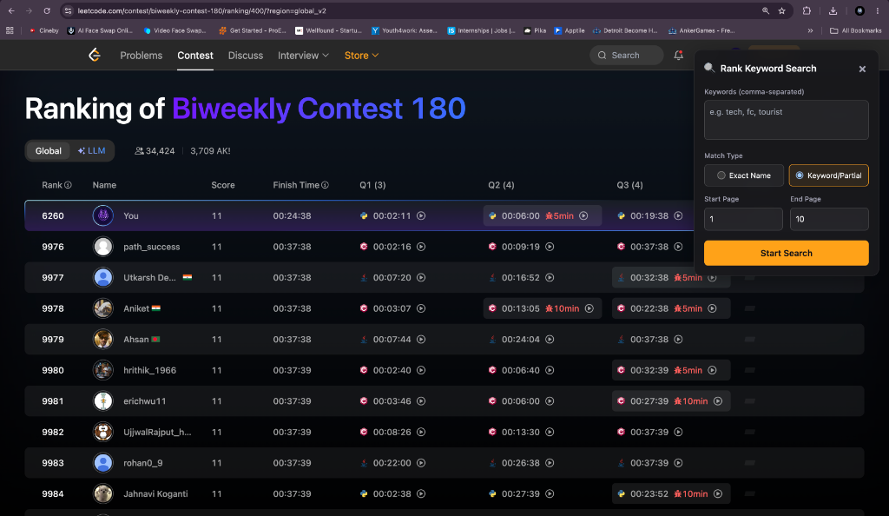

# 🔍 LeetCode Contest User & Keyword Search Extension

A powerful and premium Chrome extension designed to **locate competitors, friends, and keyword groups** in **LeetCode contest rankings** effortlessly. Instead of manually clicking through hundreds of pages, this extension automates the pagination, scrapes rankings in real-time, and shows matching usernames instantly in a beautiful floating panel.

---

## 🌟 Key Features

*   **🔎 Multi-User & Substring Matching**: Enter multiple usernames or keywords (comma-separated) to search for several accounts simultaneously.
*   **⚙️ Two Match Modes**:
    *   **Exact Name Match**: Performs a case-insensitive exact check on the username. In this mode, the search **terminates early** as soon as all targeted users are found.
    *   **Keyword/Partial Match**: Performs a case-insensitive substring search (e.g., searching for `tech` will find `tech_coder`, `techmaster`, etc.).
*   **🔢 Customizable Page Range**: Choose specific boundaries by defining `Start Page` and `End Page` (e.g., searching only page 5 to 25).
*   **📊 Real-time Progress & Results**:
    *   Dynamic visual progress bar indicating the exact percentage of pages searched.
    *   A clean, scrollable results table showing **User** and the **Page** where they were found.
*   **🛑 Stop and Reset Actions**: Stop the search process mid-way with a single click, or reset to tweak your search query.
*   **💫 Glassmorphic Dark UI**: A modern, dark-themed floating widget that integrates seamlessly with LeetCode's interface.
*   **💾 Persistent Search Session**: Leverages `sessionStorage` to maintain state, meaning the search auto-resumes and updates smoothly even after automated page redirections and reloads.
*   **⚡ Automatic Service worker script-injection**: No more "Could not establish connection" errors. The extension dynamically injects the search content script into all active LeetCode contest tabs upon installation or reload.

---

## 📸 Preview

Here’s the extension interface inside the contest page:



---

## 📥 Installation

Since this is a custom extension, you can install it locally as a developer:

1.  **Download or Clone** this repository to your computer:
    ```bash
    git clone https://github.com/AnkitPandit120/LeetSeek-user-search-extension.git
    ```
    *(Alternatively, download the ZIP archive and extract it.)*
2.  Open Google Chrome and navigate to `chrome://extensions/`.
3.  Enable **Developer mode** using the toggle switch in the top-right corner.
4.  Click the **Load unpacked** button in the top-left corner.
5.  Select the extracted project folder (`LeetSeek-user-search-extension`).

---

## 🧠 How to Use

1.  Go to any LeetCode contest ranking page. For example:
    `https://leetcode.com/contest/weekly-contest-369/ranking/`
2.  Click the **LeetCode Contest User Search** icon in your Chrome toolbar.
3.  Click the **Start User Search** button in the popup.
4.  In the floating panel that appears in the top-right corner:
    *   Enter your target usernames or keywords separated by commas in the text field.
    *   Select your preferred **Match Type** (*Exact Name* vs. *Keyword/Partial*).
    *   Set the **Start Page** and **End Page** range.
    *   Click **Start Search**.
5.  The extension will automatically navigate through the pages, scan the rank table, update the progress bar, and list any matching users alongside the page number they are located on.
6.  *Optional*: Click **🛑 Stop** to pause the search at any time, or close the panel to end the session.

---

## 📂 File Structure

```
LeetSeek-user-search-extension/
├── manifest.json        # Extension configuration (Manifest V3)
├── background.js        # Automates programmatic content-script injection
├── content.js           # Core scraping, state management, and UI panel logic
├── popup.html           # Simple popup interface
├── popup.js             # Extension button event handler
├── styles.css           # Styling for the toolbar popup
├── icon16.png           # Toolbar icon (16x16)
├── icon48.png           # Extension management page icon (48x48)
└── icon128.png          # Web Store display icon (128x128)
```

---

## 📜 License

This project is licensed under the MIT License. Feel free to use, modify, and distribute.

---

## 🙌 Credits

*   Developed with ❤️ by **[Ankit Pandit](https://github.com/ankitpandit120)**
